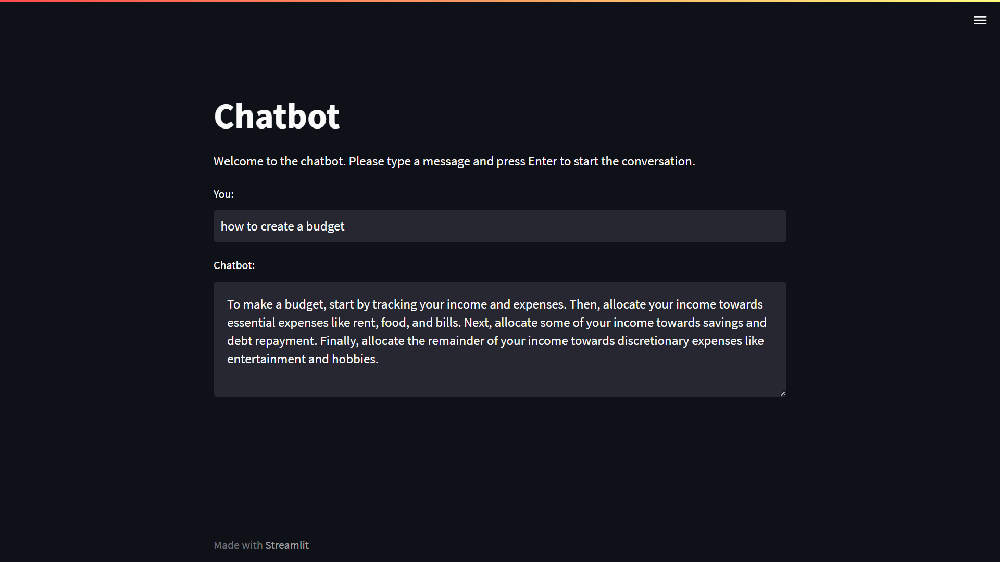

# Intents-Based Chatbot with Streamlit



The goal of this project is to create a chatbot that can understand and respond to user input based on intents. The chatbot is built using Natural Language Processing (NLP) library and Logistic Regression, to extract the intents and entities from user input. The chatbot is built using Streamlit, a Python library for building interactive web applications.

# Project Overview
The project is divided into two parts:
1. We use NLP and Logistic Regression to train the chatbot on labeled intents and entities. We use the scikit-learn library to perform the training.
2. For building the Chatbot interface, we use Streamlit to build a web-based chatbot interface. The interface allows users to input text and receive responses from the chatbot.

# Getting Started
- To get started with this project, follow these steps:
1. Clone this repository to your local machine.
```
git clone https://github.com/SannketNikam/Chatbot.git
```
1. Install the required Python libraries using:
```
pip install -r requirements.txt
```
3. Run streamlit app to launch the chatbot interface.
```
streamlit run app.py
```

# Dataset
The dataset used in this project is a collection of labelled intents and entities. The data is stored in a list.
- Intents: The intent of the user input (e.g. "greeting", "budget", "about")
- Entities: The entities extracted from user input (e.g. "Hi", "How do I create a budget?", "What is your purpose?")
- Text: The user input text.

# Streamlit Chatbot Interface
The chatbot interface is built using Streamlit. The interface includes a text input box for users to input their text and a chat window to display the chatbot's responses. The interface uses the trained model to generate responses to user input.

# Conclusion
In this project, we built a chatbot that can understand and respond to user input based on intents. The chatbot was trained using NLP and Logistic Regression, and the interface was built using Streamlit. This project can be extended by adding more data, using more sophisticated NLP techniques, such as deep learning.